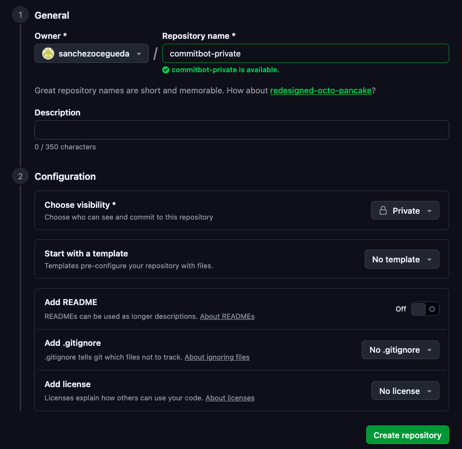
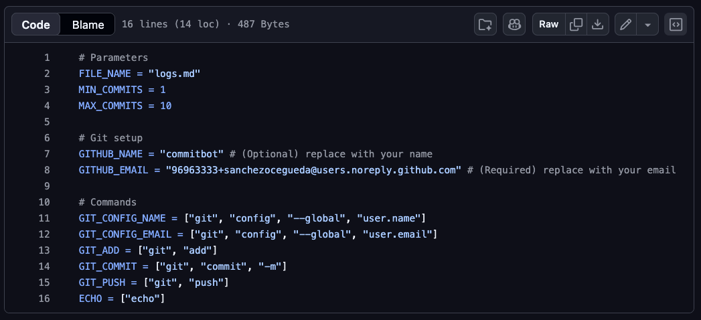
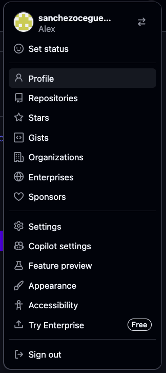
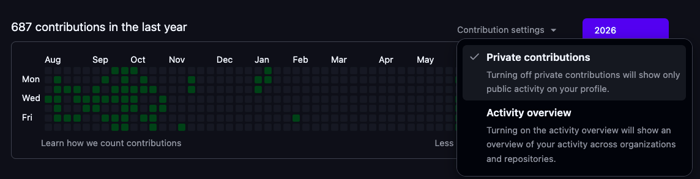
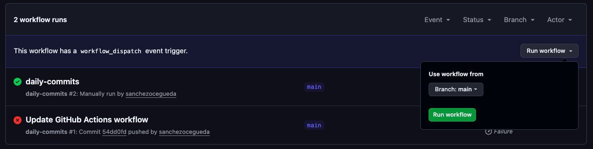
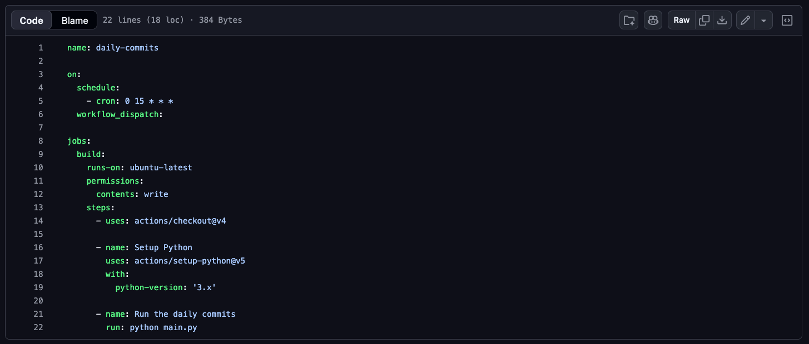

# commitbot
Keep your commit history spiffy!
`commitbot` automatically creates commits for your profile every day using GitHub Actions.
Set it up and enjoy your green squares!

## Setup

### Step 0: Star the repo

The very first step is to star the `commitbot` repo.
You can do this in a matter of seconds by pressing the Star button on the top right corner.

This is extremely important.
If you do not star the repo, then `commitbot` will self-destruct, exploding your laptop and the moon in the process.
You don't want that, do you?

### Step 1: Create a private repo
Now that you've starred the repo, we're going to create a private repo called `commitbot-private`.
Just make sure to set the visibility of the repo to private!

No need to make any other changes to the configuration.

### Step 2: Copy the code

Next, run the following commands on your terminal.
Be sure to replace the url on the third step for the one pointing to your new private repo.

1. `git clone --bare https://github.com/sanchezocegueda/commitbot.git`
2. `cd commitbot.git`
3. `git push --mirror https://github.com/your-username/commitbot-private.git` (change this to whatever your repo's url is)

**Note 1:** GitHub Actions should be enabled by default (unlike a true fork).
If it is not, you can enable it in the repository settings.

**Note 2:** some people (like me) clone through SSH instead of HTTPS.
If that's the case for you, just use those links instead.

### Step 3: Modify the config
Now that the repo is set up, you just need to change the `config.py` file.
You can do this directly on the GitHub website.

Click on the `config.py` file link **on your private repo's website**.
You should then be able to see the following file contents.

Simply click the pencil icon on the top right corner.
Then, replace the `GITHUB_EMAIL` parameter with your own email.
The tool will not work unless you set your email here.
Double-check that it is the same email that you use for your GitHub account.

You can also change the `MIN_COMMITS` and `MAX_COMMITS` parameters if you want more or less commits per day on average.

If you want a name other than "commitbot" to show up on the commit messages, you can change the `GITHUB_NAME` parameter too.

### Step 4: Enable private contributions

If you haven't already, make sure to allow your profile to display private contributions.
You can do this by clicking on your user icon, then clicking on the Profile button.

Then, click on the Contribution settings button and click the Private contributions button to turn on the feature.
If it is enabled, you will see a checkmark like in the picture below:

### Step 5: Profit
You're done!
Enjoy the green squares!

## Optional steps

### Testing
Do you want to test the functionality before the scheduled time?
You can run the workflow manually in the Actions -> daily-commits page by using the Run workflow button.

### Changing the commit time and frequency
You can change the default commit time by modifying the `.github/workflows/daily_commit.yml` file.

By default, it is set to go off at 8am PDT (3pm UTC).
By changing line 5 to any valid `cron` expression, you will change the time and frequency at which the GitHub Actions workflow triggers.

## How it works
`commitbot` runs a simple Python script each day at a scheduled time (default 8am PDT).
This is run as a `cron` job in GitHub actions.
The Python script picks a random number `num_commits` between `MIN_COMMITS` to `MAX_COMMITS` (inclusive).

Then, it runs the following loop `num_commits` times:
1. Append a new timestamped line to `logs.md`.
2. Commit the new changes.

Once it's run the commits, commitbot will push everything to your private repo, which will show up in your commit history.
