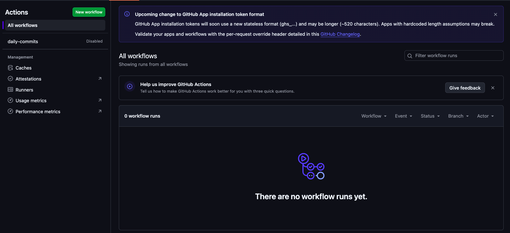

### Enabling the GitHub Actions workflow

First, fork the repo.
You can do this by hitting the Fork button on the top right corner of the `commitbot` GitHub repo page.

Choose yourself as the owner and feel free to rename the repo to whatever you want.
Once you've chosen a suitable name, go ahead and press the Create fork button on the bottom right corner.

Next, go to the Actions page.
You can access the page by going to the Actions button on the repo toolbar.

There, you will be greeted with the following warning:

This is a security measure to ensure that cloned repos don't run code without your knowledge.

Be sure to verify yourself, but the only action being run in this repo is in `.github/workflows/daily_commit.yml`, and it does exactly what you think it does.

Once you trust my repo enough, click on the green "I understand my workflows, go ahead and enable them" button.
You will then be greeted by the following screen:

You'll find that the `daily_commits` workflow is still disabled.
This is because scheduled workflows are disabled by default on GitHub Actions.
To enable the workflow (and get your daily green squares going), you need to click on it on the left navigation bar.

Now simply click on the Enable workflow button to get the workflow running.
You can also give feedback to GitHub Actions if you want, but I have more fun ways to waste my time.

2. 

Clone the repo to your machine.
Add your key.
Done! Enjoy your effortless looking commit history.